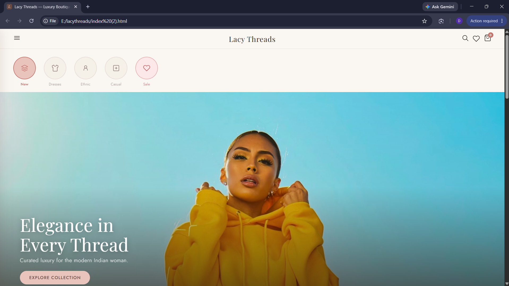
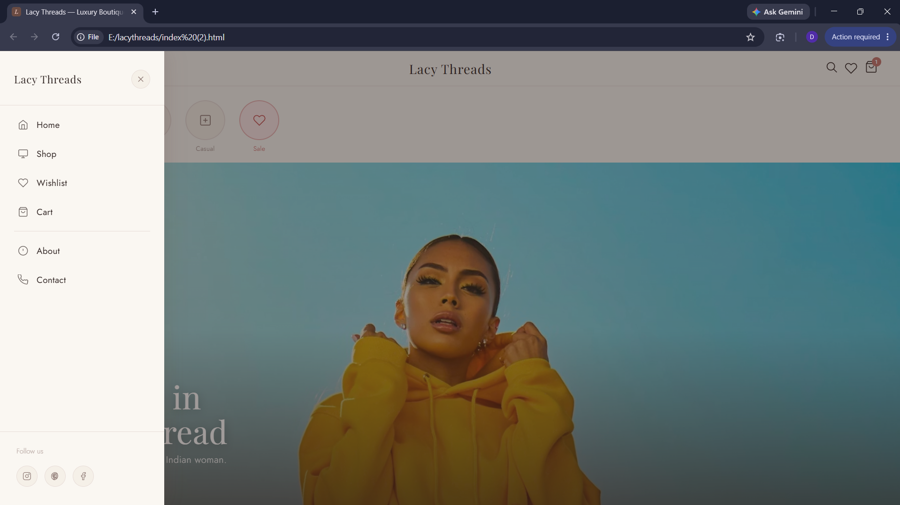
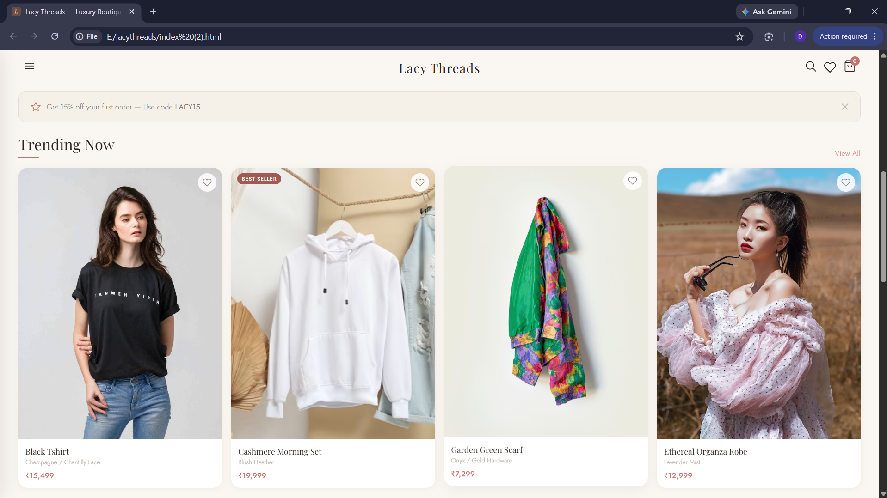
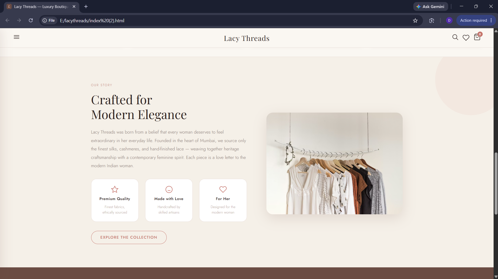
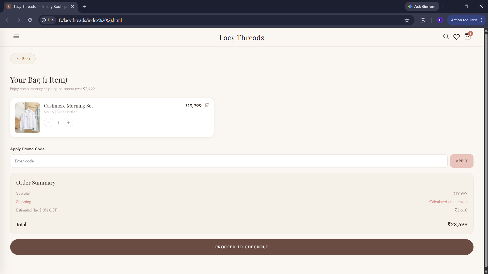
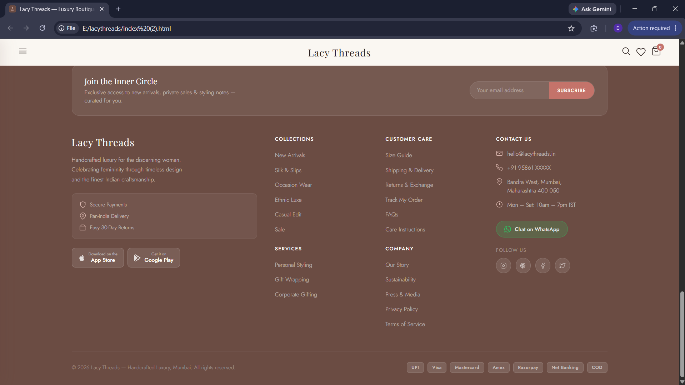
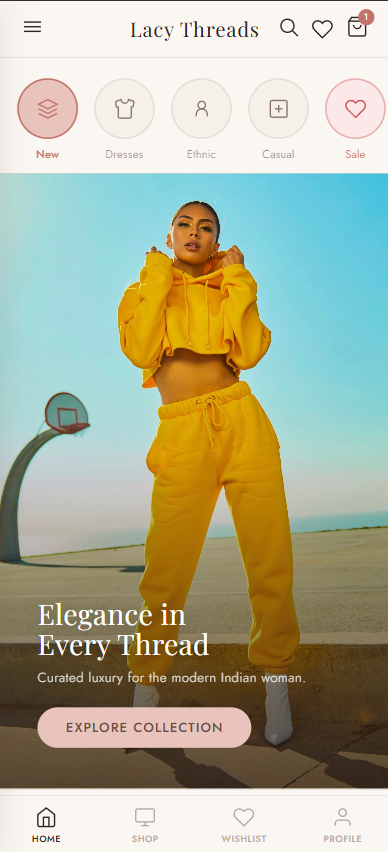

# Lacy Threads – Luxury Fashion Boutique Website

## Full Stack Web Development Internship  
### Task 3 – Local Business Website & Live Pitch Project

---

## Overview

Lacy Threads is a modern luxury fashion boutique website built to simulate how real local fashion businesses can establish a strong digital presence and attract customers online.

It provides a premium boutique-style shopping experience with elegant UI/UX, responsive layouts, interactive product browsing, advanced filtering systems, wishlist functionality, shopping cart interactions, and modern fashion-inspired design — replicating real-world luxury fashion e-commerce websites.

This project is designed with responsive frontend architecture, clean UI structure, smooth animations, and professional user experience, making it suitable for real business presentation and portfolio showcase. :contentReference[oaicite:0]{index=0}

---

## Objective

The goal of Lacy Threads is to build a system that:

- Creates a luxury online shopping experience  
- Helps local boutique businesses improve digital presence  
- Builds customer trust through premium branding  
- Organizes products professionally  
- Demonstrates real-world frontend development  
- Simulates a real client-based web development workflow  
- Provides responsive shopping experiences across devices  

---

## Tech Stack

### Frontend
- HTML5  
- CSS3  
- JavaScript  

### UI & Styling
- Custom CSS  
- Responsive Flexbox Layouts  
- CSS Grid Layouts  
- Luxury Boutique UI Design  
- Smooth CSS Animations & Transitions  

### Fonts & Design
- Google Fonts  
  - Playfair Display  
  - Jost  

### Tools Used
- VS Code  
- GitHub  
- Vercel Deployment  

---

## Architecture (Frontend Boutique Website)

Lacy Threads is built as a responsive frontend fashion boutique website:

- Single-page interactive frontend structure  
- Mobile-first responsive design  
- Dynamic product browsing experience  
- Interactive shopping cart system  
- Wishlist management system  
- Responsive sidebar navigation  
- Boutique-style premium UI/UX  
- Optimized layouts for mobile, tablet, and desktop devices  :contentReference[oaicite:1]{index=1}

---

## Core Features

### Luxury Homepage
- Elegant cinematic hero section  
- Boutique-inspired branding  
- Trending collections showcase  
- Promotional offers section  
- Interactive category navigation  

---

### Product Browsing
- Responsive product cards  
- Product pricing display  
- Wishlist icons  
- Product badges  
- Interactive hover effects  
- Product detail pages  

---

### Search & Filters
- Functional product search system  
- Size filter dropdown  
- Price filter dropdown  
- Product sorting functionality  
- Responsive filter menus  

---

### Wishlist System
- Add/remove wishlist products  
- Dynamic wishlist counter  
- Dedicated wishlist page  
- Interactive wishlist icons  

---

### Shopping Cart
- Dynamic cart functionality  
- Product quantity controls  
- Delete cart items  
- Order summary section  
- Promo code section  
- Checkout button interface  

---

### Product Detail System
- Large product preview section  
- Product image gallery  
- Size selection buttons  
- Product accordion sections  
- Add-to-cart functionality  

---

### Responsive Navigation
- Sticky navigation bar  
- Sidebar hamburger menu  
- Mobile bottom navigation  
- Smooth page navigation  
- Functional navigation icons  

---

### Brand Story Section
- Boutique brand introduction  
- Fashion storytelling layout  
- Luxury branding presentation  
- Responsive promotional section  

---

### Footer System
- Newsletter subscription section  
- Social media buttons  
- Contact information  
- Payment badges  
- Mobile accordion footer  
- WhatsApp contact button  

---

## System Workflow

1. User visits the boutique homepage  
2. Customer browses trending collections  
3. Products are filtered using dropdown menus  
4. User searches products by keywords  
5. Customer adds products to wishlist/cart  
6. Product details are explored  
7. Customer reviews pricing and collections  
8. User contacts the boutique through website details  

---

## Project Structure

```bash
/lacy-threads

│

├── index.html
├── /assets
├── /images
├── README.md
```

---

## Features Implemented

- Responsive luxury boutique UI  
- Functional product search  
- Dynamic filter dropdowns  
- Product sorting system  
- Wishlist functionality  
- Shopping cart interactions  
- Sidebar navigation menu  
- Product detail previews  
- Mobile-responsive layouts  
- Newsletter section  
- Interactive animations & transitions  
- Footer contact system  
- Responsive product grids  
- Smooth scrolling navigation  :contentReference[oaicite:2]{index=2}

---

## Design Highlights

### UI/UX Features
- Luxury fashion-inspired interface  
- Elegant typography system  
- Boutique-style color palette  
- Cinematic hero banner  
- Smooth hover animations  
- Minimal premium aesthetic  

### Responsive Experience
- Mobile-first layout optimization  
- Tablet responsiveness  
- Desktop grid layouts  
- Adaptive navigation systems  

---

## Setup & Run

```bash
Open the project folder
```

```bash
Run index.html in browser
```

OR

```bash
Use Live Server Extension in VS Code
```

---

## Key Learning Outcomes

- Built a real-world boutique website  
- Improved frontend architecture skills  
- Learned responsive web design principles  
- Designed luxury UI/UX interfaces  
- Implemented shopping cart systems  
- Built wishlist management functionality  
- Improved CSS layout structuring  
- Learned interactive frontend development  
- Understood real business website presentation  
- Learned how local businesses use websites for branding  

---

## Live Demo

```bash
https://future-fs-03-beta-six.vercel.app/
```

---

## Repository

```bash
https://github.com/devadharshinichandramohan-ops/FUTURE_FS_03
```

---

## Preview









---

## Contact

- Email: [devadharshinichandramohan@gmail.com](mailto:devadharshinichandramohan@gmail.com)
- GitHub: https://github.com/devadharshinichandramohan-ops
- LinkedIn: https://www.linkedin.com/in/devadharshini-chandramohan-88546037b/

---

## Internship

Submitted for:

**Future Interns – Full Stack Web Development Internship (2026)**

Task 3 – Local Business Website & Live Pitch Project
